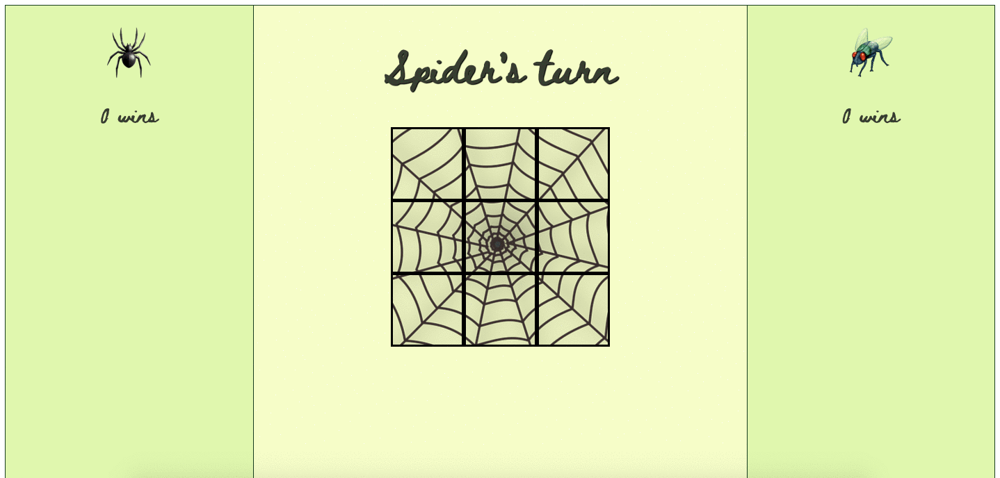
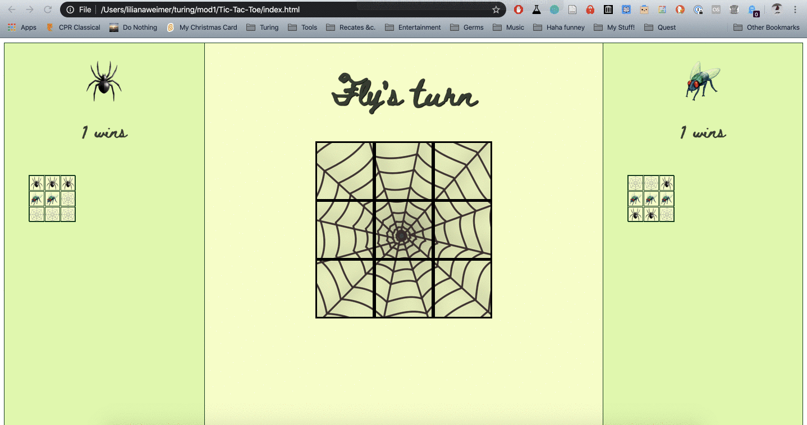
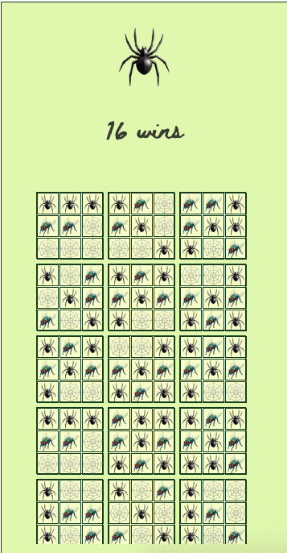

# Tic-Tac-Toe
Final solo project, Turing Mod 1

Liliana Weimer

GitHub profile: https://github.com/lilianaweimer

## About Project:
This is the final project from the Turing School for Software and Design's Mod 1. It is the second solo project of the mod, and it builds on the previous two group projects. The aim of the project is to create a functional Tic Tac Toe game from the ground up. This is the first game we have built in the program and because of that it has proven to be extra challenging. It is intended to challenge our logical thinking and problem-solving abilities, as well as solidify our understanding of concepts we have learned throughout the mod. The specification can be found [here](https://frontend.turing.io/projects/module-1/tic-tac-toe-solo.html).

## Technologies Used:
- HTML
- CSS
- JavaScript
- Git/GitHub

## Project Goals:
#### From specification:
- Solidify and demonstrate your understanding of:
  - DRY JavaScript
  - localStorage to persist data
  - event delegation to handle similar event listeners
- Understand the difference between the data model and how the data is displayed on the DOM
- Iterate through/filter DOM elements using for loops
- Use your problem solving process to break down large problems, solve things step by step, and trust yourself to not rely on an outside “answer” to a logical challenge

#### Personal goals:
- Get better at asking for help, while making sure that I fully understand the help I am given
- Manage a complicated and difficult project by breaking it down into smaller steps rather than getting overwhelmed by it
- Improve understanding of classes, especially how they interact with each other
- Make something fun that I am proud of!

## Wins:
- Building the HTML and CSS relatively fast compared to previous projects
  - I like the theme I picked (spider vs. fly), I think it's fun
- Using what I learned from the last projects to make grid and flexbox work more effectively
- Creating a plan to work off of and conceptualize the project ([Google Doc of plan](https://docs.google.com/document/d/1c8mTybTz8za_oVB5nvgW8WkvojqSyblAodd9VS_o9lk/edit?usp=sharing))
- Figuring out that using numbers can make `checkWinConditions` work (without DOM)
- Successfully implementing `localStorage`
- Using logic to work my way through the process of how the game should work
- Successfully implementing feedback from mentors, instructors, and others
- Fixing bugs along the way

## Challenges:
- Conceptualizing how to start with the data model rather than the DOM
- The `checkWinConditions` method held me up for an entire day
- Connecting classes to the DOM
- Breaking the project down into manageable chunks
- One error persists, that I cannot find the source of:
  - When an image is double-clicked, there is an error due to its class changing and `takeTurn` calling `changeGameboardTile`
  - This error does not break the game, however
- Refactoring occasionally broke other parts of the game, which I had to work my way through fixing (time consuming and sometimes confusing)
- Fixing bugs along the way

## In Action:

Playing a few rounds

Refreshing the page

Scrollbar appears when there are enough wins
